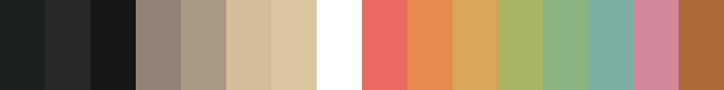

# base16

A [base16](https://github.com/tinted-theming/base16) scheme repo for
**Gogh**, a dark theme built from an existing kitty terminal config. It
builds themed configs for kitty and Neovim from one 16-color palette, and
ships as an installable Neovim colorscheme.



## Layout

- `schemes/gogh.yaml` — the palette: 16 colors (`base00`-`base0F`), plus
  scheme name/author. This is the single source of truth; everything else
  is generated from it.
- `templates/` — [Mustache](https://mustache.github.io/) templates that
  turn a scheme into a themed config file, plus one plain file:
  - `kitty.mustache` — kitty terminal config.
  - `colors/lua.mustache` — generates the `colors/<scheme>.lua` file
    Neovim's `:colorscheme` command loads directly.
  - `lua/base16-colorscheme.lua` — the highlight-group engine
    `colors/<scheme>.lua` delegates to. Not Mustache (it takes any base16
    palette as a parameter, so there's nothing scheme-specific to
    substitute) — `build.sh` copies it verbatim into
    `lua/base16-colorscheme.lua`.
- `colors/gogh.lua`, `lua/base16-colorscheme.lua` — the installable Neovim
  colorscheme. See [NVIM.md](NVIM.md) for how to install and use it.
- `base16-builder-php/` — a git submodule that does the actual rendering:
  a PHP base16 builder that renders a scheme + a template into one output
  file.
- `base16-spectrum-generator/` — a git submodule that renders a scheme's
  16 colors into a preview PNG (`palette/<scheme>.png`), used for the
  image at the top of this README.
- `build.sh` / `setup.sh` — the build pipeline (see below).
- `output/` — build artifacts (gitignored, regenerated by `build.sh`).

## Building

```sh
./build.sh
```

This installs/updates submodule dependencies (`setup.sh`), renders every
template in `templates/` against every scheme in `schemes/` into `output/`,
copies the generated `output/colors/*.lua` files into `colors/` (so the
Neovim colorscheme stays in sync with the scheme YAML), and renders a
`palette/<scheme>.png` preview image per scheme.

`colors/*.lua`, `lua/base16-colorscheme.lua`, and `palette/*.png` are
gitignored locally — they're build output, not something to hand-edit or
commit yourself. CI (`.github/workflows/build.yml`) runs `build.sh` on
every push to `main` and force-commits the regenerated files back, since
`lazy.nvim`/`vim.pack` clone `main` directly and need `colors/*.lua` to be
there without ever running `build.sh` — and so the README's embedded
palette image stays in sync with `schemes/*.yaml`.

Adding a new theme is just adding a new `schemes/<name>.yaml` file with the
16 base colors and rerunning `./build.sh` — every template, including the
Neovim colorscheme, is generated for it automatically.

## Using the colorscheme in Neovim

See [NVIM.md](NVIM.md) for lazy.nvim and `vim.pack` install instructions.
